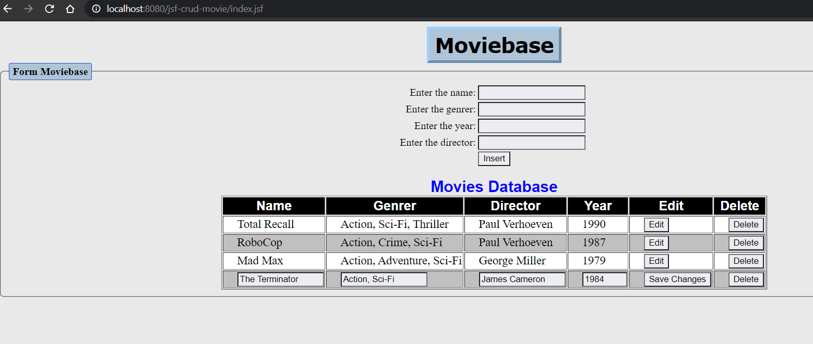
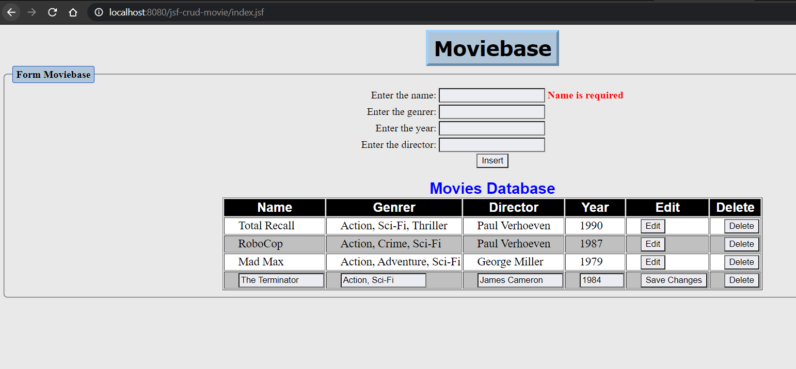

# JSF CRUD MOVIE
> CRUD operations in a table without use of database

A simple project using pure JSF and MVC architecture that allow create, read, update and delete data, in this case, a movie catalog.

Sceenshot (click to see demonstration on YouTube)

## Examples

This project can be adaptable to any souce of data, allowing to manipulate rows without need to external databases. Below some examples of how it works.

#### Edit row

#### Validation name required

#### Validation input type year

## How to import

Import... -> General -> Project from Folder or Archive.

### Configure aspects of the project

- Right click on the project -> Properties
- Project Aspects
- In Runtimes, select the application server

## Meta

Marcio Kriiger - [in/marciokriiger](https://www.linkedin.com/in/marciokriiger/) - marciovonkriiger@gmail.com
[https://github.com/marciokriiger/jsf-crud-movie](https://github.com/marciokriiger)

Special thanks to Rafael Santos da Silva - [rafssilva](https://github.com/rafssilva), who helped me in the implementation of this project. 
